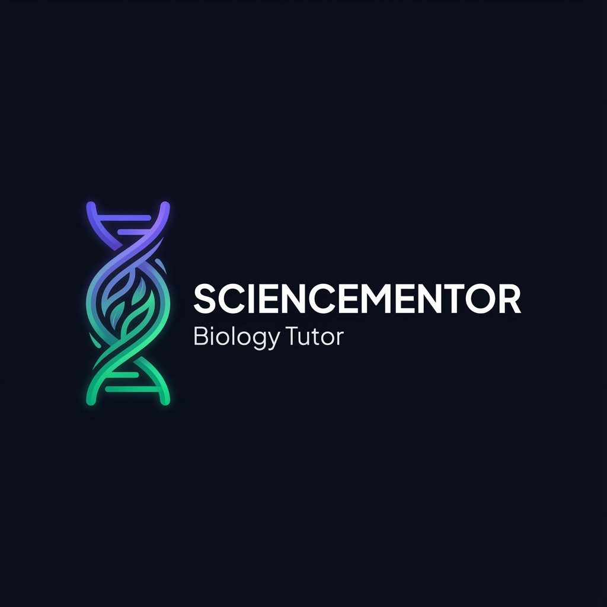

# SCIENCEMENTOR Branding Assets

This directory contains the official branding assets for SCIENCEMENTOR.

## Logo Files

### Logo (`logo.png`)



**Usage:**

- Main application logo
- Marketing materials
- Documentation headers
- Social media profiles

**Specifications:**

- Format: PNG with transparency
- Colors: Purple (#6366f1) to Green (#10b981) gradient
- Style: Modern, flat design with DNA helix icon
- Includes: Icon + "SCIENCEMENTOR" wordmark + "Biology Tutor" tagline

### Favicon (`favicon.png`)


**Usage:**

- Browser tab icon
- Bookmark icon
- Mobile home screen icon
- PWA app icon

**Specifications:**

- Format: PNG
- Size: 512x512px (scales to all sizes)
- Design: Simplified DNA helix icon
- Colors: Purple to green gradient
- Style: Minimalist, recognizable at small sizes

## Brand Colors

### Primary Palette

```css
--primary: #6366f1          /* Vibrant Purple */
--primary-light: #818cf8    /* Light Purple */
--primary-dark: #4f46e5     /* Dark Purple */

--accent: #10b981           /* Emerald Green */
--accent-light: #34d399     /* Light Green */
```

### Secondary Palette

```css
--secondary: #f472b6        /* Pink */
--tertiary: #fbbf24         /* Amber */
--quaternary: #22d3ee       /* Cyan */
```

### Dark Theme

```css
--bg-dark: #0f0f1a
--sidebar-bg: #13131f
--main-bg: #1a1a2e
--surface: #252538
```

## Typography

**Primary Font:** Plus Jakarta Sans

- Weights: 400 (Regular), 500 (Medium), 600 (Semi-Bold), 700 (Bold)
- Source: Google Fonts

## Brand Guidelines

### Logo Usage

✅ **DO:**

- Use the full logo on light or dark backgrounds
- Maintain minimum clear space around the logo
- Use the favicon for small icon representations
- Keep the gradient colors intact

❌ **DON'T:**

- Distort or stretch the logo
- Change the gradient colors
- Add effects (shadows, outlines, etc.)
- Use low-resolution versions
- Separate the icon from the wordmark in the full logo

### Color Usage

The purple-to-green gradient represents:

- **Purple:** Knowledge, wisdom, education
- **Green:** Growth, life, biology

Use the gradient for:

- Primary UI components
- Call-to-action buttons
- Important highlights
- Brand elements

## File Management

All branding assets are version-controlled in this repository.

**File Structure:**

```
frontend/
├── favicon.png       # Browser favicon
├── logo.png          # Full application logo
└── BRANDING.md       # This file
```

## Regeneration

If you need to regenerate or modify the logo/favicon:

1. Use the same color palette
2. Maintain the DNA helix theme
3. Keep the modern, educational aesthetic
4. Ensure readability at all sizes

---

**Last Updated:** December 21, 2025  
**Version:** 1.0
